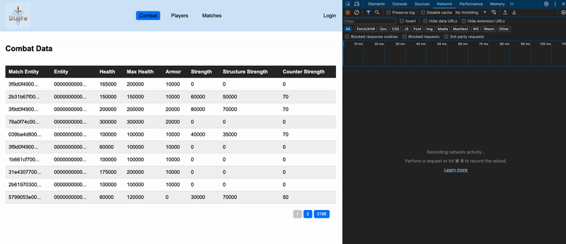

# Redstone Blockchain Data Explorer

## Overview
This project provides a web-based interface to explore and display data from the Redstone Holesky Blockchain, specifically focusing on game data. Utilizing the Primodium Indexer for data retrieval, it features a PostgreSQL database for storage, a Node.js backend for data manipulation and API endpoints, and a simple frontend for user interaction.



### Features
- Data retrieval from the Redstone Holesky Blockchain via Primodium Indexer.
- PostgreSQL database integration for efficient data storage.
- RESTful API endpoints for data access and manipulation.
- Basic frontend for displaying blockchain game data.
- Dynamic data querying based on game, player, and match.

## Prerequisites
- Node.js 
- PostgreSQL 
- Docker (For running the indexer and database)

## Installation

### Clone the Repository
```bash
git clone <repository-url>
cd <project-directory>
```
Install Dependencies
```bash
npm install
```

Database Setup
Ensure PostgreSQL is running and execute the following commands to set up your database:

```bash
psql -d postgres
CREATE ROLE root SUPERUSER LOGIN;
```
Run the MudIndexer with Docker
Replace environment variables as necessary.
```bash
docker run --platform linux/amd64 -e 'DEBUG=mud:*' -e RPC_HTTP_URL=https://rpc.holesky.redstone.xyz -e RPC_WS_URL=wss://rpc.holesky.redstone.xyz/ws -e DATABASE_URL=postgres://host.docker.internal/postgres -e START_BLOCK=895629 -p 3001:3001 ghcr.io/latticexyz/store-indexer:latest pnpm start:postgres-decoded
```

Running the Project
Start the Backend Server
```bash
node app.js
```

This starts the backend server on http://localhost:3003. The API can be accessed at 
```bash
http://localhost:3003/api
```

Accessing the Frontend
Open your web browser and navigate to http://localhost:3003 to interact with the frontend and explore blockchain game data.
